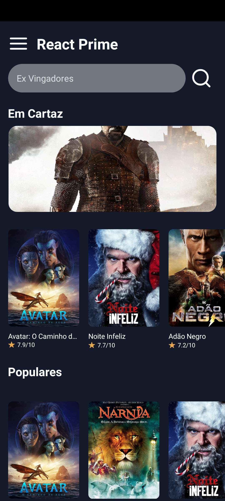
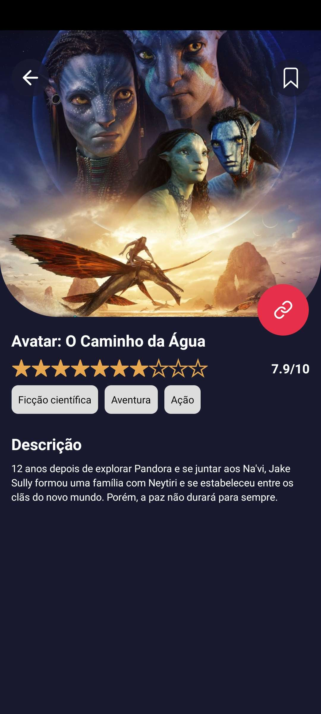

### Rodando a aplicação no seu PC

Faça um clone deste repositório e instale no seu ambiente de desenvolvimento usando o seguinte comando no seu terminal (escolha um diretório apropriado):

OBS: Para rodar a api, você precisa gerar uma key no site do [tmdb](https://www.themoviedb.org/)

```shell
git clone https://github.com/Aguiiiar/app-filmes.git
```

Após clonar o conteúdo do repositório, acesse o diretório criado e efetue a instalação das dependências:

```shell
cd app-filmes

npm install
ou
yarn
```

Após essa instalação execute a aplicação com o comando `npm run start` ou `yarn start` ou escolha o device que você quer executar `android` | `ios`.

### Tecnologias:

[](https://skillicons.dev)

## Homepage



## Detalhes



## Meus Filmes


